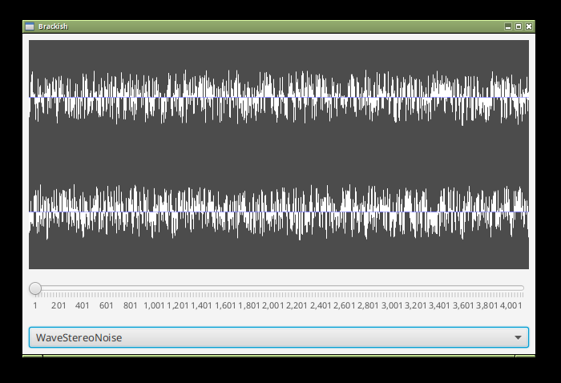

brackish
===

| JVM | Platform | Status |
|-----|----------|--------|
| OpenJDK (Temurin) Current | Linux | |
| OpenJDK (Temurin) LTS | Linux | |
| OpenJDK (Temurin) Current | Windows | |
| OpenJDK (Temurin) LTS | Windows | |

## brackish

A JavaFX component for rendering waveforms.

## Features

* Render waveforms in realtime.
* Zoom and scroll waveforms.
* Written in pure Java 21.
* [OSGi-ready](https://www.osgi.org/)
* [JPMS-ready](https://en.wikipedia.org/wiki/Java_Platform_Module_System)
* ISC license.

## Usage

Add a `WaveView` to your JavaFX layouts. Implement the `WaveModelType` interface
to allow the application to sample waveforms.

## Demo

A [demo application](com.io7m.brackish.demo) is included.

